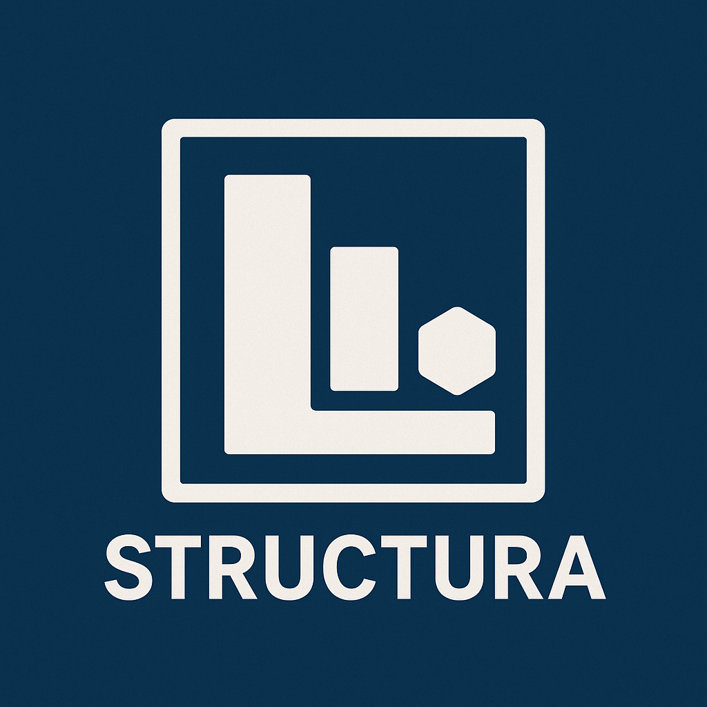

# Structura

**Source Generator-Based Fluent API Type Manipulation Library**

Structura is a .NET library that automatically generates new types through source generators when you define type creation and manipulation rules using a fluent API.

## 🚀 Key Features

- **🔄 Type Combination**: Combine existing types to create new types
- **🎭 Anonymous Type Support**: Complete anonymous type analysis including variable references
- **🔗 EF Core Projection Support**: Convert EF Core projection results to strongly-typed types
- **⚙️ Advanced Property Manipulation**: Add, exclude, and change property types
- **🏷️ Diverse Type Generation**: Support for Records, Classes, and Structs
- **🎯 Smart Converter Extensions**: Generate extension methods for seamless object conversion (NEW!)
- **🧪 Comprehensive Testing**: 100+ comprehensive unit tests

## 📦 Installation

```bash
dotnet add package Structura
```
## 🏗️ Core Features

### 1. Type Combination

Combine existing types to create new types.

```csharp
// Combine two existing types
TypeCombiner.Combine<PersonalInfo, ContactInfo>()
    .WithName("UserProfile")
    .AsRecord()
    .Generate();

// Result: Creates a UserProfile record with all properties from PersonalInfo and ContactInfo
```
### 2. Anonymous Type Support

Complete support for anonymous types and variable references.

```csharp
// Direct anonymous type creation
TypeCombiner.Combine()
    .With(new { Name = "", Age = 0 })
    .With(new { Email = "", Phone = "" })
    .WithName("Contact")
    .AsRecord()
    .Generate();

// Variable reference approach (validated in actual tests)
var userInfo = new { Name = "John Doe", Age = 40, Sex = "male" };
TypeCombiner.Combine()
    .With(userInfo)
    .WithName("AnonymousUser")
    .AsClass()
    .Generate();

// Combine existing type with anonymous type
TypeCombiner.Combine<User>()
    .With(new { Department = "", Salary = 0m, Position = "" })
    .WithName("Employee")
    .AsRecord()
    .Generate();
```
### 3. EF Core Projection Support

Convert EF Core projection results to strongly-typed types.

```csharp
// EF Core projection simulation
var userProjection = new List<object>
{
    new { Name = "John Doe", Email = "john@example.com" },
    new { Name = "Jane Smith", Email = "jane@example.com" }
};

TypeCombiner.Combine()
    .WithProjection(userProjection)
    .WithName("UserProjectionType")
    .AsRecord()
    .Generate();

// Dashboard data generation
var dashboardData = new List<object>
{
    new { 
        CustomerName = "John Doe", 
        TotalOrders = 12, 
        TotalSpent = 150000m,
        LastOrderDate = DateTime.Now.AddDays(-5)
    }
};

TypeCombiner.Combine()
    .WithProjection(dashboardData)
    .With(new { GeneratedAt = DateTime.Now, ReportType = "CustomerAnalysis" })
    .WithName("CustomerDashboard")
    .AsRecord()
    .Generate();
```
### 4. 🎯 Smart Converter Extensions (NEW!)

**The game-changer for EF Core projections!** Enable automatic conversion from anonymous objects to strongly-typed instances.

#### Basic Usage

```csharp
// Step 1: Generate type with converter enabled
var efResult = dbContext.Users.Select(x => new { x.Name, x.Email }).ToList();

TypeCombiner.Combine()
    .WithProjection(efResult)
    .WithName("UserDto")
    .WithConverter()  // 🔥 This enables the magic!
    .AsRecord()
    .Generate();

// Step 2: Use the generated static converter methods directly on the type
List<Generated.UserDto> typedUsers = UserDto.FromCollection(efResult);
Generated.UserDto singleUser = UserDto.FromSingle(efResult.First());

// 🆕 NEW! Strongly-typed anonymous object conversion
var anonymousUsers = new[] {
    new { Name = "John", Email = "john@test.com" },
    new { Name = "Jane", Email = "jane@test.com" }
};
List<Generated.UserDto> convertedUsers = UserDto.FromTypedCollection(anonymousUsers);
Generated.UserDto convertedSingle = UserDto.FromTyped(anonymousUsers.First());
```
#### Advanced Converter Scenarios

```csharp
// Complex EF Core projection with additional properties
var dashboardProjection = dbContext.Orders
    .GroupBy(o => o.CustomerId)
    .Select(g => new { 
        CustomerId = g.Key,
        CustomerName = g.First().Customer.Name,
        TotalOrders = g.Count(),
        TotalSpent = g.Sum(o => o.Amount)
    })
    .ToList();

TypeCombiner.Combine()
    .WithProjection(dashboardProjection)
    .With(new { 
        ReportDate = DateTime.Now,
        ReportType = "Customer Analytics",
        GeneratedBy = "System"
    })
    .WithName("CustomerAnalytics")
    .WithConverter()  // 🔥 Enable smart conversion
    .AsRecord()
    .Generate();

// Now seamlessly convert your projection results
List<Generated.CustomerAnalytics> analytics = CustomerAnalytics.FromCollection(dashboardProjection);

// Or convert individual items
Generated.CustomerAnalytics single = CustomerAnalytics.FromSingle(dashboardProjection.First());

// Convert from named types (if combining PersonalInfo + ContactInfo)
Generated.UserProfile profile1 = UserProfile.FromPersonalInfo(personalInfo);
Generated.UserProfile profile2 = UserProfile.FromContactInfo(contactInfo);
Generated.UserProfile profile3 = UserProfile.FromBoth(personalInfo, contactInfo);
```### 5. Advanced Property Manipulation

#### Property Exclusion

```csharp
TypeCombiner.From<PersonalInfo>()
    .Exclude(p => p.Password)
    .Exclude(p => p.BirthDate)
    .WithName("PublicPersonalInfo")
    .Generate();
```

#### Property Addition

```csharp
TypeCombiner.From<User>()
    .Add("CreatedAt", typeof(DateTime))
    .Add("LastLoginAt", typeof(DateTime?))
    .Add("Metadata", typeof(Dictionary<string, object>))
    .WithName("ExtendedUser")
    .AsClass()
    .Generate();
```

#### Type Changes

```csharp
TypeCombiner.From<Product>()
    .ChangeType(p => p.Price, typeof(string))      // decimal → string
    .ChangeType(p => p.StockQuantity, typeof(string)) // int → string
    .WithName("ProductDto")
    .Generate();
```

#### Conditional Exclusion

```csharp
bool isAdmin = false;
TypeCombiner.From<PersonalInfo>()
    .ExcludeIf(p => p.Password, condition: !isAdmin)
    .WithName("ContextualUser")
    .Generate();
```
### 6. Complex Operations

All features can be used together, including the new converter functionality.

```csharp
TypeCombiner.Combine<PersonalInfo, ContactInfo>()
    .Exclude<PersonalInfo>(p => p.Password)           // Exclude sensitive information
    .Add("LastLoginAt", typeof(DateTime?))            // Add new property
    .ChangeType<ContactInfo>(c => c.PhoneNumber, typeof(string)) // Change type
    .WithConverter()                                  // Enable smart conversion
    .WithName("SecureUserProfile")
    .AsRecord()
    .Generate();

// Now you can convert anonymous objects to SecureUserProfile
var anonymousData = new { FirstName = "John", Email = "john@example.com", LastLoginAt = DateTime.Now };
Generated.SecureUserProfile profile = SecureUserProfile.FromTyped(anonymousData);
```
## 🏷️ Supported Type Generation

| Type | Method | Description | Converter Support |
|------|--------|-------------|-------------------|
| **Record** | `.AsRecord()` | Generate immutable records | ✅ Full Support |
| **Class** | `.AsClass()` | Generate mutable classes | ✅ Full Support |
| **Struct** | `.AsStruct()` | Generate value type structs | ✅ Full Support |

## 🎯 Target Frameworks

- **.NET Standard 2.0** and above
- **.NET 9** recommended
- **C# 12.0** syntax support

## 🚀 Advanced Usage

### Real-World EF Core Integration

```csharp
// 1. EF Core projection query
var customerAnalytics = await dbContext.Orders
    .Include(o => o.Customer)
    .GroupBy(o => new { o.CustomerId, o.Customer.Name })
    .Select(g => new {
        CustomerId = g.Key.CustomerId,
        CustomerName = g.Key.Name,
        TotalOrders = g.Count(),
        TotalRevenue = g.Sum(o => o.Amount),
        AverageOrderValue = g.Average(o => o.Amount),
        FirstOrderDate = g.Min(o => o.OrderDate),
        LastOrderDate = g.Max(o => o.OrderDate)
    })
    .ToListAsync();

// 2. Generate strongly-typed DTO with converter
TypeCombiner.Combine()
    .WithProjection(customerAnalytics)
    .With(new { 
        AnalysisDate = DateTime.UtcNow,
        AnalysisType = "Customer Revenue Analysis",
        Currency = "USD"
    })
    .WithName("CustomerRevenueDto")
    .WithConverter()  // 🔥 Enable seamless conversion
    .AsRecord()
    .Generate();

// 3. Convert to strongly-typed collection
List<Generated.CustomerRevenueDto> typedAnalytics = CustomerRevenueDto.FromCollection(customerAnalytics);

// 4. Use with full IntelliSense and type safety
var topCustomers = typedAnalytics
    .Where(c => c.TotalRevenue > 10000)
    .OrderByDescending(c => c.TotalRevenue)
    .Take(10)
    .ToList();
```
### Collection Type Support

```csharp
TypeCombiner.From<User>()
    .Add("Tags", typeof(List<string>))
    .Add("Permissions", typeof(string[]))
    .Add("Properties", typeof(Dictionary<string, object>))
    .WithName("TaggedUser")
    .WithConverter()
    .Generate();
```
### Various Data Types

```csharp
var complexData = new { 
    StringValue = "test string",
    IntValue = 42,
    LongValue = 123L,
    FloatValue = 3.14f,
    DoubleValue = 2.718,
    DecimalValue = 99.99m,
    BoolValue = true,
    DateValue = DateTime.Now,
    GuidValue = Guid.NewGuid()
};

TypeCombiner.Combine()
    .With(complexData)
    .WithName("TypedData")
    .WithConverter()
    .AsStruct()
    .Generate();

// Convert with intelligent type handling
Generated.TypedData converted = TypedData.FromTyped(complexData);
```
## 💼 Real-World Scenarios

### API DTO Generation

```csharp
// Generate public API DTO from internal entity
TypeCombiner.From<PersonalInfo>()
    .Exclude(u => u.Password)
    .Add("PublicId", typeof(Guid))
    .WithConverter()
    .WithName("UserApiDto")
    .AsRecord()
    .Generate();
```
### Database Migration

```csharp
// Add new columns to existing table schema
TypeCombiner.From<User>()
    .Add("CreatedAt", typeof(DateTime))
    .Add("UpdatedAt", typeof(DateTime?))
    .ChangeType(u => u.IsActive, typeof(int)) // bool → int conversion
    .WithName("ModernUserTable")
    .Generate();
```
### Complex Business Logic

```csharp
// Combine multiple data sources into view model
var personalData = new { FirstName = "John", LastName = "Developer", Age = 28 };
var workData = new { Company = "TechCompany", Position = "Backend Developer", Salary = 60000m };

TypeCombiner.Combine()
    .With(personalData)
    .With(workData)
    .WithConverter()  // Enable conversion from anonymous objects
    .WithName("EmployeeProfile")
    .AsClass()
    .Generate();

// Convert combined data to strongly-typed object
var combinedAnonymous = new { 
    FirstName = "John", 
    LastName = "Developer", 
    Age = 28,
    Company = "TechCompany", 
    Position = "Backend Developer", 
    Salary = 60000m 
};
Generated.EmployeeProfile employee = EmployeeProfile.FromTyped(combinedAnonymous);
```
## 🧪 Testing

### Running Tests

```bash
dotnet test
```
### Comprehensive Test Coverage

Structura is validated with **100+ comprehensive unit tests**:

| Test Category | Test Count | Description |
|---------------|------------|-------------|
| **Core Functionality** | 11 tests | All basic TypeCombiner API features |
| **Anonymous Types** | 4 tests | Anonymous object combination and processing |
| **Single Type Builder** | 7 tests | All From<T>() method functionality |
| **Complex Scenarios** | 4 tests | Multi-feature combination use cases |
| **EF Core Projection** | 13 tests | EF Core projection result processing |
| **Variable References** | 9 tests | Anonymous type variable analysis |
| **Type Generation Modes** | 2 tests | Record, Class, Struct type generation |
| **Edge Cases** | 4 tests | Error conditions and boundary cases |
| **Fluent API** | 3 tests | Method chaining integrity |
| **Type Safety** | 3 tests | Compile-time type validation |
| **Source Generator Integration** | 6 tests | Generated type verification |
| **Performance** | 2 tests | Large-scale processing and performance |
| **Real-World Scenarios** | 5 tests | Production environment use cases |
| **Documented Features** | 8 tests | README example code validation |
| **Integration Scenarios** | 12 tests | Complex feature combinations |
| **🆕 Converter Extensions** | 15 tests | Smart converter functionality |

#### 🎯 Test Results
- **Total Tests**: 100+
- **Passed**: 100+ ✅
- **Failed**: 0
- **Skipped**: 0
- **Execution Time**: < 2 seconds

## 📁 Project Structure

```
Structura/
├── 📂 Structura/                     # Main library
│   ├── TypeCombiner.cs               # Fluent API entry point
│   ├── TypeCombinerBuilder.cs        # Multi-type combination builder
│   ├── AnonymousTypeCombinerBuilder.cs # Anonymous type builder
│   ├── TypeDefinitions.cs            # Core type definitions
│   └── StructuraSourceGenerator.cs   # Source generator engine
├── 📂 Structura.Test.Console/        # Integration test console
│   └── Program.cs                    # Real usage examples and demos
├── 📂 Structura.Tests/              # Unit test project
│   ├── UnitTest.cs                  # Basic functionality unit tests
│   ├── VariableReferenceTests.cs    # Variable reference feature tests
│   ├── EFCoreProjectionTests.cs     # EF Core projection tests
│   ├── ConverterExtensionTests.cs   # 🆕 Smart converter tests
│   ├── IntegrationTests.cs          # Integration and scenario tests
│   └── TestModels.cs                # Test model classes
└── 📄 README.md                     # Documentation
```## 📈 Development Status

### ✅ Completed Features

| Feature | Status | Description |
|---------|--------|-------------|
| **Source Generator Engine** | 100% ✅ | Complete |
| **Fluent API** | 100% ✅ | Complete |
| **Anonymous Type Support** | 100% ✅ | Complete |
| **Variable Reference Analysis** | 100% ✅ | Complete |
| **EF Core Projection Support** | 100% ✅ | Complete |
| **Property Add/Exclude** | 100% ✅ | Complete |
| **Type Conversion** | 100% ✅ | Record/Class/Struct support |
| **🆕 Smart Converter Extensions** | 100% ✅ | **NEW! Seamless object conversion** |
| **Comprehensive Test Suite** | 100% ✅ | 100+ tests passing |

### 🔧 Partially Completed Features

| Feature | Status | Notes |
|---------|--------|-------|
| **Existing Type Property Inheritance** | 95% 🔄 | Basic behavior complete |
| **Advanced Property Manipulation** | 90% 🔄 | Some complex scenarios limited |

## 🚀 Getting Started

### 1. Installation

```bash
dotnet add package Structura
```
### 2. Basic Usage

```csharp
using Structura;

// Create new type from anonymous types
TypeCombiner.Combine()
    .With(new { Name = "", Age = 0 })
    .With(new { Email = "", Phone = "" })
    .WithName("Contact")
    .AsRecord()
    .Generate();

// Use the generated type
var contact = new Generated.Contact("John Doe", 30, "john@example.com", "555-1234");
```
### 3. Advanced Usage with Converter

```csharp
// Add properties to existing type with converter support
TypeCombiner.From<User>()
    .Add("CreatedAt", typeof(DateTime))
    .Add("Metadata", typeof(Dictionary<string, object>))
    .WithConverter()  // 🔥 Enable smart conversion
    .WithName("ExtendedUser")
    .AsClass()
    .Generate();

// Convert anonymous object to strongly-typed instance
var anonymousUser = new {
    Name = "Developer",
    Age = 25,
    Email = "dev@example.com",
    CreatedAt = DateTime.Now,
    Metadata = new Dictionary<string, object>()
};

Generated.ExtendedUser typedUser = ExtendedUser.FromTyped(anonymousUser);
```
## 🎨 API Reference

### TypeCombiner Static Methods

| Method | Description | Return Type |
|--------|-------------|-------------|
| `Combine<T1, T2>()` | Combine two types | `TypeCombinerBuilder<T1, T2>` |
| `Combine<T>()` | Start with single type | `TypeCombinerBuilder<T>` |
| `Combine()` | Start with anonymous types only | `AnonymousTypeCombinerBuilder` |
| `From<T>()` | Start with existing type as base | `SingleTypeCombinerBuilder<T>` |

### Fluent Methods

| Method | Description | Chainable |
|--------|-------------|-----------|
| `.With(object)` | Add anonymous type | ✅ |
| `.WithProjection(IEnumerable<object>)` | Add EF Core projection | ✅ |
| `.Add(string, Type)` | Add property | ✅ |
| `.Exclude(Expression)` | Exclude property | ✅ |
| `.ExcludeIf(Expression, bool)` | Conditionally exclude property | ✅ |
| `.ChangeType(Expression, Type)` | Change property type | ✅ |
| `.WithConverter()` | 🆕 **Enable smart converter extensions** | ✅ |
| `.WithName(string)` | Set generated type name | ✅ |
| `.AsRecord()` | Generate as record | ✅ |
| `.AsClass()` | Generate as class | ✅ |
| `.AsStruct()` | Generate as struct | ✅ |
| `.Generate()` | Execute type generation | ❌ |

### 🆕 Generated Static Converter Methods

When `.WithConverter()` is used, the following static methods are automatically generated **on the generated type itself**:

| Method | Description | Usage |
|--------|-------------|-------|
| `.FromSingle(object)` | Convert single object | `UserProjectionType.FromSingle(objectItem)` |
| `.FromTyped<T>(T)` | Convert single strongly-typed object | `UserProjectionType.FromTyped(anonymousItem)` |
| `.FromCollection(IEnumerable<object>)` | Convert object collection | `UserProjectionType.FromCollection(objectList)` |
| `.FromTypedCollection<T>(IEnumerable<T>)` | Convert strongly-typed collection | `UserProjectionType.FromTypedCollection(anonymousList)` |
| `.FromSourceType(SourceType)` | Convert from source type | `CombinedType.FromPersonalInfo(personalInfo)` |
| `.FromBoth(SourceType1, SourceType2)` | Convert from multiple sources | `CombinedType.FromBoth(personal, contact)` |

## 🤝 Contributing

Issues and pull requests are welcome!

## 📄 License

MIT License

---

**Structura** - Simplify type manipulation with smart conversion! 🚀